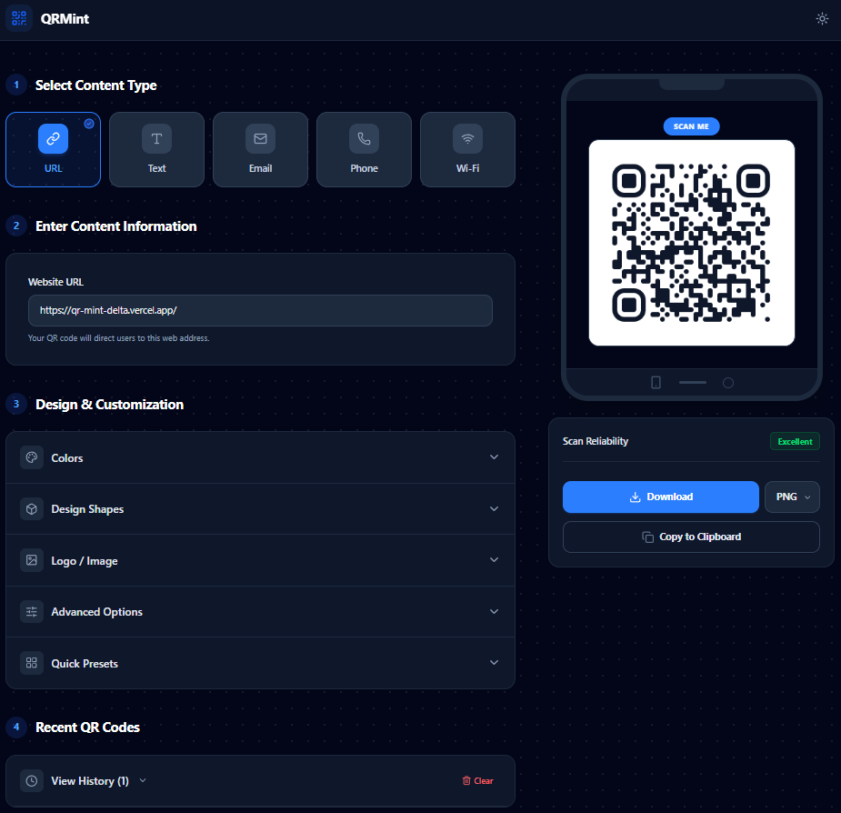

# QR Mint: QR Code Generator & Designer

Welcome to **QR Mint**, a powerful and highly customizable QR code generator designed for speed, flexibility, and beautiful aesthetics. Generate, customize, preview, and download QR codes purely in your browser without any backend dependencies!
## 📸 Screenshots

## 🚀 Features

- **Multi-Type Support**: Generate QR codes for URLs, Plain Text, Emails, Phone Numbers, and Wi-Fi networks.
- **Real-Time Live Preview**: Instantly see changes as you adjust colors, shapes, padding, size, and error correction levels.
- **Style Presets**: Choose from predefined themes ("Classic Monochrome", "Corporate Navy", "Neon Cyberpunk", "Warm Sunset") to jumpstart customization.
- **Accessibility & Scan Reliability**: 
  - Real-time WCAG-compliant relative luminance contrast checker warns if colors are too similar.
  - Warns against using low error correction (L) when embedding a logo.
- **100% In-Browser Export**: Download as PNG, SVG, or copy the image directly to the clipboard.
- **Local Persistence**: Automatically saves the last 10 generated QR configurations to your browser's `localStorage` for easy retrieval.
- **Responsive & Accessible UI**: Responsive two-column layout on desktop stacking to a single column on mobile, with a built-in Dark/Light mode toggle.

## 🛠️ Technical Stack

- **Framework**: React 19 (TypeScript) initialized with Vite.
- **Styling**: Tailwind CSS v4 + Lucide React (for UI icons).
- **QR Engine**: `qr-code-styling` (for advanced canvas/SVG generation).
- **Persistence**: Native Browser `localStorage`.

## 🏗️ Architecture & State Management

The application state is managed reactively through React hooks, primarily localized in `App.tsx` and pushed down to functional components.

- **`qrData` state**: Holds the semantic information about the QR code payload (e.g., the URL, or the Wi-Fi SSID and password).
- **`settings` state**: Holds the visual configuration for the QR code (colors, shapes, logo). It also includes the `data` string, which is derived from `qrData`.
- **`history` state**: Uses a custom `useLocalStorage` hook to persist the 10 most recent configurations. 

State synchronization happens via standard `useEffect` hooks:
1. When `qrData` changes, `utils/qrFormatter.ts` builds the correct payload string (e.g., `WIFI:T:WPA;S:MyNet;P:password;;`).
2. The `settings.data` is updated to trigger a re-render of the `QRPreview` component.
3. A debounced effect captures snapshots of `qrData` and `settings` and pushes them into the `history` array stored in `localStorage`.

## 🛡️ Edge Cases Handled

- **Contrast Warning**: The `utils/contrast.ts` module calculates the relative luminance (WCAG standard) of the chosen foreground and background colors. If the ratio drops below `3:1`, a non-blocking UI alert is shown to warn the user about potential scan issues.
- **URI Formatting**: Generating correct URI schemas (`mailto:`, `tel:`, `WIFI:`) is handled safely, escaping parameters where necessary.
- **Empty States & Local Storage Fallback**: The app fails gracefully if `localStorage` is disabled or corrupted. It defaults to sensible starting configurations, avoiding runtime crashes.
- **Logo Error Correction**: Logos obscure part of the QR code matrix. The UI intelligently warns users if they try to embed a logo while using a Low (L - 7%) Error Correction level, which could make the code unreadable.

---
*Built for GDG On Campus Technical Assessment.*
